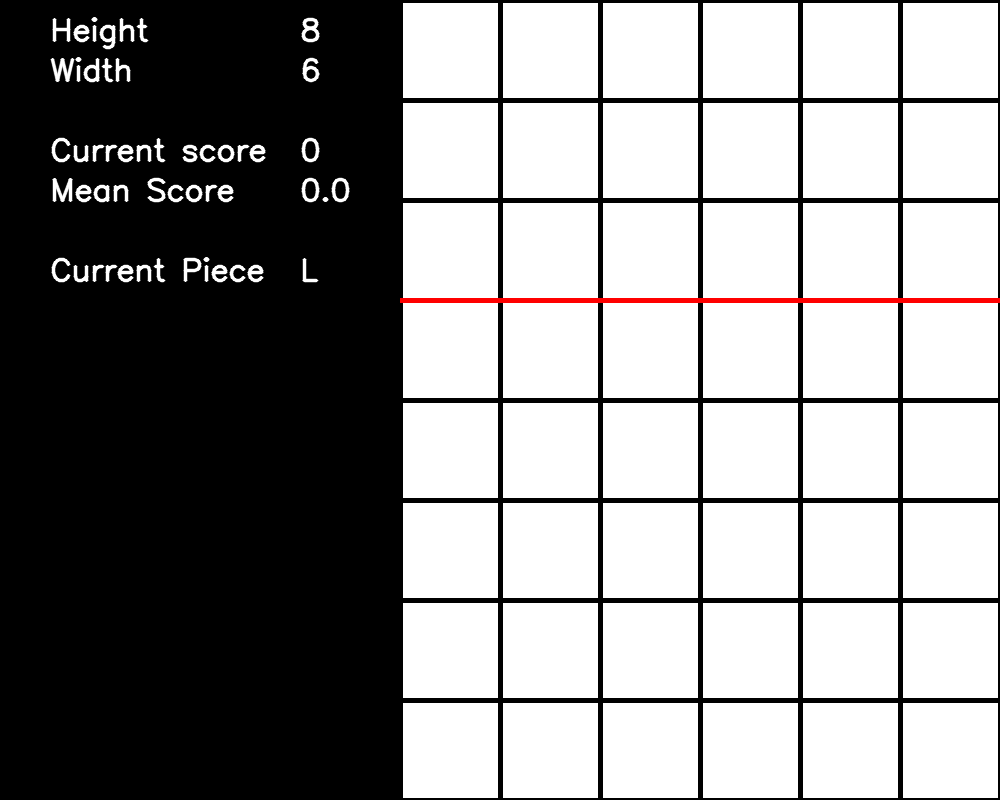

# Gym-SimplifiedTetris 

Gym-SimplifiedTetris is a Python package for creating simplified reinforcement learning (RL) environments for Tetris that conform to the [OpenAI Gym](https://github.com/openai/gym) API.

This README summarises the package's functionality, describes how to build more custom environments, and provides an example showing how to use an environment.

<p align="center">
    
</p>

The environments are simplified because the artificial agent must select the column and piece's rotation before the piece is dropped vertically downwards. To the best of the author's knowledge, this is the first open-source package to create RL Gym environments that use the simplified setting, commonly used by previous approaches.

# Getting started

## Cloning

To clone the repository:
```bash
git clone https://github.com/OliverOverend/gym-simplifiedtetristemp
```

## Versions

- Python 3.7.4
- NumPy 1.16.5
- Gym 0.18.0
- OpenCV-Python 4.5.1
- Matplotlib 3.4.2
- Pillow 6.2.0
- Stable-Baselines3 1.1.0

# Functionality

## Available environments

There are currently two environments provided:
- `simplifiedtetris-binary-v0`: The observation space is a flattened NumPy array containing a binary representation of the grid, plus the current piece's ID.
- `simplifiedtetris-partbinary-v0`: The observation space is a flattened NumPy array containing a binary representation of the grid excluding the top `piece_size` rows, plus the current piece's ID.

## Variable dimensions and piece size

The user can easily specify the grid dimensions and choose from four different sets of pieces: monominos, dominos, trominoes & Tetriminos. Below is a GIF showing games being played on a 8 x 6 grid with trominoes as the pieces.

<p align="center">
    
</p>

## Action and observation spaces

Each environment comes with an `observation_space` that is a `Box` space and an `action_space` that is a `Discrete` space. At each time step, the artificial agent must choose an action (an integer from a particular range). Each action maps to a translation/rotation tuple that specifies the column to drop the piece and its rotation. The ranges for the four different piece sizes are:
- Monominos: [0, w - 1]
- Dominos: [0, 2w - 2]
- Trominoes: [0, 4w - 5]
- Tetriminos: [0, 4w  - 7]

## Step method

Each environment's step method returns four values:
- `observation` (**NumPy array**): a 1D array that contains some binary representation of the grid, plus the current piece's ID.
- `reward` (**float**): the amount of reward received from the previous action.
- `done` (**bool**): a game termination flag.
- `info` (**dict**): only contains the `num_rows_cleared` due to taking the previous action.

## Game ending

As per Colin Fahey's specification, each standard game of Tetris terminates if the following condition is satisfied: any of the dropped piece's square blocks enters into the top `piece_size` rows before any full rows are cleared.

## Example

Here is an example of using an instance of the `simplifiedtetris-binary-v0` environment for ten games:

```python
import gym

import gym_simplifiedtetris

env = gym.make('simplifiedtetris-binary-v0')
obs = env.reset()

# Run 10 games of Tetris, selecting actions uniformly at random.
num_episodes = 0
while num_episodes < 10:
    env.render()
    action = env.action_space.sample()
    obs, rwd, done, info = env.step(action)

    if done:
        print(f"Episode {num_episodes + 1} has terminated.")
        num_episodes += 1
        obs = env.reset()

env.close()
```

# Building more environments

More custom Gym environments with different observation spaces and reward functions can be implemented easily. To add more environments to `gym_simplifiedtetris.register.env_list`, ensure that they inherit from `SimplifiedTetrisBinaryEnv` and are registered using:
```python
register(
    idx='INSERT_ENV_NAME_HERE',
    entry_point='gym_simplifiedtetris.envs:INSERT_ENV_CLASS_NAME_HERE',
)
```

# Coming soon

- Unit tests

# Suggestions

Please feel free to provide any suggestions or raise any issues you encounter.

# Credits

This package utilises several methods from the [codebase](https://github.com/andreanlay/tetris-ai-deep-reinforcement-learning) developed by Lay (2020). 