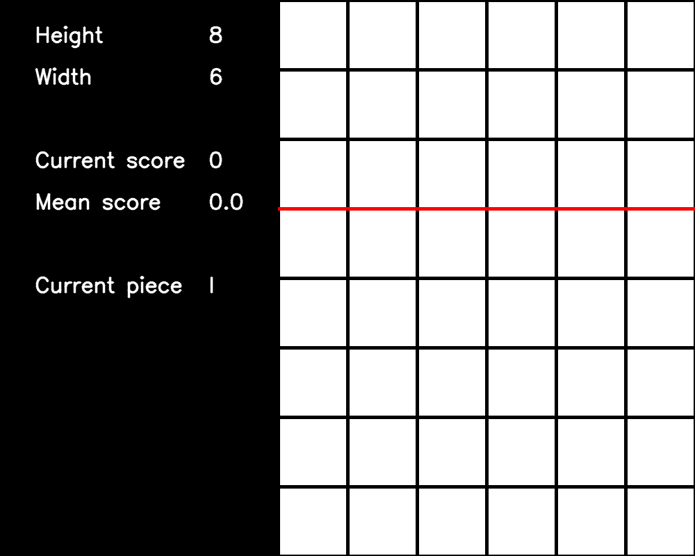

<h1 align="center"> Gym-SimplifiedTetris </h1> <br>
<p align="center">
    
  </a>
</p>

## Table of Contents <!-- omit in toc -->

- [1. Introduction :information_source:](#1-introduction-information_source)
- [2. Getting started :clipboard:](#2-getting-started-clipboard)
- [3. Environments :earth_africa:](#3-environments-earth_africa)
  - [3.1. Available environments](#31-available-environments)
  - [3.2. Building more environments](#32-building-more-environments)
  - [3.3. Methods](#33-methods)
    - [3.3.1. `reset()` method](#331-reset-method)
    - [3.3.2. `step(action: int)` method](#332-stepaction-int-method)
    - [3.3.3. `render()` method](#333-render-method)
    - [3.3.3. `close()` method](#333-close-method)
  - [3.4. Variable dimensions and piece size](#34-variable-dimensions-and-piece-size)
  - [3.5. Action and observation spaces](#35-action-and-observation-spaces)
  - [3.6. Game ending](#36-game-ending)
  - [3.7. Usage](#37-usage)
- [4. Checklist :white_check_mark:](#4-checklist-white_check_mark)
- [5. Contributing :bulb:](#5-contributing-bulb)
- [6. Credits :raised_hands:](#6-credits-raised_hands)
- [7. License :memo:](#7-license-memo)

## 1. Introduction :information_source:

<p align="left">
  <a href="/LICENSE.md">
    
  </a>
  <a href="http://makeapullrequest.com">
    
  </a>
  <a href="https://www.codefactor.io/repository/github/oliveroverend/gym-simplifiedtetristemp">
    
  </a>
</p>

Gym-SimplifiedTetris is a Python package that can create *simplified* reinforcement learning (RL) environments for Tetris that conform to the [OpenAI Gym](https://github.com/openai/gym) API. The environments are simplified because the artificial agent must select the column and piece's rotation before the piece is dropped vertically downwards. To the best of the author's knowledge, this is the first open-source package to create RL Gym environments that use the simplified setting — used by most of the previous approaches to the game of Tetris.

This README provides some help with the setup, gives an overview of the environments and how to use them, and describes how to build more environments.

## 2. Getting started :clipboard:

To clone the repository:
```bash
git clone https://github.com/OliverOverend/gym-simplifiedtetristemp
```

Here is a list of the versions used during development:

- Python==3.7.4
- NumPy==1.16.5
- Gym==0.18.0
- OpenCV-Python==4.5.1
- Matplotlib==3.4.2
- Pillow==6.2.0
- Stable-Baselines3==1.1.0

## 3. Environments :earth_africa:

### 3.1. Available environments

There are currently two environments provided:
- `simplifiedtetris-binary-v0`: The observation space is a flattened NumPy array containing a binary representation of the grid, plus the current piece's ID
- `simplifiedtetris-partbinary-v0`: The observation space is a flattened NumPy array containing a binary representation of the grid excluding the top `piece_size` rows, plus the current piece's ID

### 3.2. Building more environments

More custom Gym environments with different observation spaces and reward functions can be implemented easily. To add more environments to `gym_simplifiedtetris.register.env_list`, ensure that they inherit from `SimplifiedTetrisBinaryEnv` and are registered using:
```python
register(
    idx='INSERT_ENV_NAME_HERE',
    entry_point='gym_simplifiedtetris.envs:INSERT_ENV_CLASS_NAME_HERE',
)
```

### 3.3. Methods

#### 3.3.1. `reset()` method

The `reset()` method returns a 1D array containing some grid binary representation, plus the current piece's ID.

```python
obs = env.reset()
```

#### 3.3.2. `step(action: int)` method

Each environment's step method returns four values:
- `observation` (**NumPy array**): a 1D array that contains some binary representation of the grid, plus the current piece's ID
- `reward` (**float**): the amount of reward received from the previous action
- `done` (**bool**): a game termination flag
- `info` (**dict**): only contains the `num_rows_cleared` due to taking the previous action

```python
obs, rwd, done, info = env.step(action)
```

#### 3.3.3. `render()` method

The user has access to the following controls during rendering:
- Pause (**SPACEBAR**)
- Speed up (**RIGHT key**)
- Slow down (**LEFT key**)
- Quit (**ESC**)

```python
env.render()
```

#### 3.3.3. `close()` method

The user can close all open windows using:

```python
env.close()
```

### 3.4. Variable dimensions and piece size

The user can deviate from the standard grid dimensions and Tetriminos by editing the `gym_register` keyword arguments. The user can choose from four different sets of pieces: monominos, dominos, trominoes & Tetriminos. The user can select a height in the interval [`piece_size`+1, 20] and a width in the interval [`piece_size`, 10]. Below is a GIF showing games being played on a 8 x 6 grid with trominoes as the pieces.

<p align="center">
    
</p>

### 3.5. Action and observation spaces

Each environment comes with an `observation_space` that is a `Box` space and an `action_space` that is a `Discrete` space. At each time step, the artificial agent must choose an action (an integer from a particular range). Each action maps to a translation/rotation tuple that specifies the column to drop the piece and its rotation. The ranges for the four different piece sizes are:
- Monominos: [0, w - 1]
- Dominos: [0, 2w - 2]
- Trominoes: [0, 4w - 5]
- Tetriminos: [0, 4w  - 7]

where w is the grid width.

### 3.6. Game ending

Each game of Tetris terminates if the following condition is satisfied: any of the dropped piece's square blocks enter into the top `piece_size` rows before any full rows are cleared. This definition ensures that scores achieved are lower bounds on the score that could have been obtained on a standard game of Tetris, as laid out in Colin Fahey's ['Standard Tetris' specification](https://www.colinfahey.com/tetris/tetris.html#:~:text=5.%20%22Standard%20Tetris%22%20specification).

### 3.7. Usage

Here is an example of using an instance of the `simplifiedtetris-binary-v0` environment for ten games:

```python
import gym

import gym_simplifiedtetris

env = gym.make('simplifiedtetris-binary-v0')
obs = env.reset()

# Run 10 games of Tetris, selecting actions uniformly at random.
num_episodes = 0
while num_episodes < 10:
    env.render()
    action = env.action_space.sample()
    obs, rwd, done, info = env.step(action)

    if done:
        print(f"Episode {num_episodes + 1} has terminated.")
        num_episodes += 1
        obs = env.reset()

env.close()
```

Alternatively, the env can be imported directly:
```python
from gym_simplifiedtetris.envs import SimplifiedTetrisBinaryEnv as Tetris

env = Tetris(
    grid_dims=(20, 10),
    piece_size=4,
)
```

## 4. Checklist :white_check_mark:

- [X] Unit tests
- [ ] Agents:
  - [ ] Heuristic
  - [ ] Q-learning
  - [ ] Uniform
- [ ] Environments with:
  - [ ] Different observation spaces
  - [ ] Different reward functions
  - [ ] Alternative action space representation
  - [ ] Normalised observation spaces

## 5. Contributing :bulb:

Please feel free to provide any suggestions [here](https://github.com/OliverOverend/gym-simplifiedtetristemp/discussions/new). Please report any bugs [here](https://github.com/OliverOverend/gym-simplifiedtetristemp/issues/new?assignees=OliverOverend&labels=bug&template=BUG_REPORT.md&title=%5BBUG%5D%3A) or create a feature request [here](https://github.com/OliverOverend/gym-simplifiedtetristemp/issues/new?assignees=OliverOverend&labels=enhancement&template=FEATURE_REQUEST.md&title=%5BFEATURE%5D%3A).

## 6. Credits :raised_hands:

This package utilises several methods from the [codebase](https://github.com/andreanlay/tetris-ai-deep-reinforcement-learning) developed by andreanlay (2020). The class hierarchy design was inspired by a [codebase](https://github.com/Hewiiitt/Gym-Circuitboard) developed by Hewiiitt.

## 7. License :memo:

This project is licensed under the terms of the [MIT license](/LICENSE.md).